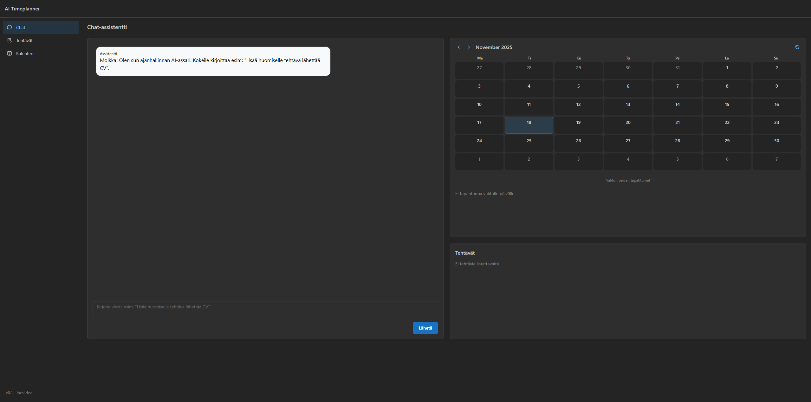
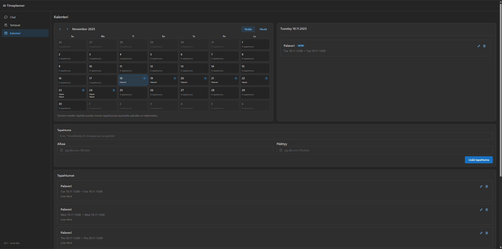
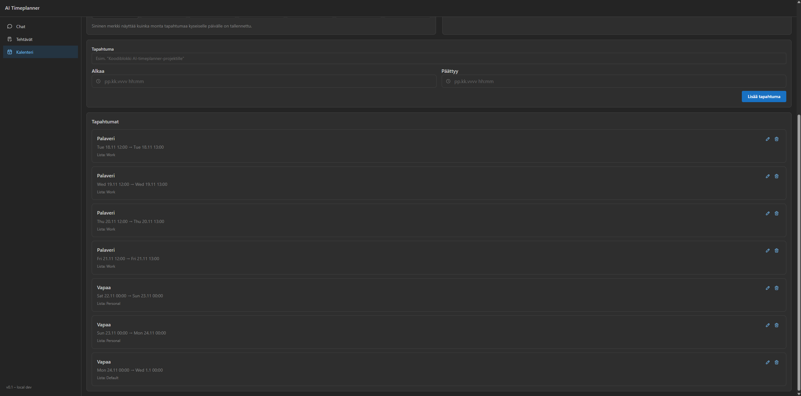
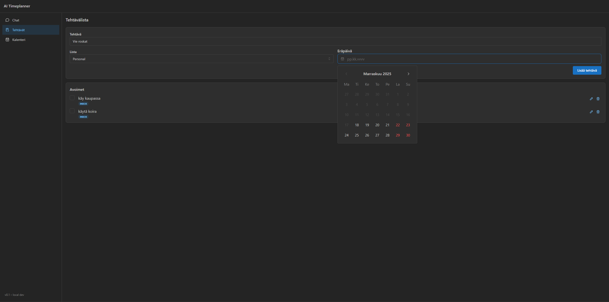

# AI Timeplanner
> **For recruiters:** AI-powered productivity assistant with a Python Azure Functions backend (Cosmos DB, Azure OpenAI tool calls) and a React/Mantine frontend that handles task + multi-day calendar management, conversational automation, and mini-calendar insights. Built end-to-end with secure secret handling and deploy-ready docs.

AI Timeplanner is an AI-assisted personal planner that combines a conversational assistant, task management and a real calendar view – all running on Azure.

The idea is simple:

> Talk to your planner in plain language (“Lisää huomiselle klo 18–20 koodiblokki”, “Luo tehtävä lähettää CV listalle Work”) and let Azure OpenAI + Azure Functions handle the rest.

The backend interprets your intent, calls tools like `create_task` and `create_event`, and stores everything in Cosmos DB. The frontend then renders the updated tasks and calendar in real time.

---

## High-level overview

**Two main parts:**

- **Backend** – Azure Functions (Python)  
  - HTTP API under `/api` (`/tasks`, `/events`, `/chat`)  
  - Integrates with **Azure OpenAI** (chat + tool calls)  
  - Persists data to **Azure Cosmos DB** (`tasks` & `events` containers)

- **Frontend** – React + Vite SPA  
  - Built with **TypeScript** and **Mantine UI**  
  - Screens for **chat**, **tasks** and a **full calendar view**  
  - Uses a dev proxy so `/api/*` goes straight to the Functions host locally

---

## What it can do

### Conversational assistant

A chat-first experience where the assistant can:

- Understand natural language in Finnish and English
- Decide when to call tools (Azure OpenAI **function calling**)
- Create tasks and calendar events via `create_task` and `create_event`
- Confirm what it did in plain language (“Lisäsin tehtävän…”, “Lisäsin kalenteriin…”)

The key point: the assistant doesn’t just *talk* – it actually mutates backend state.

### Tasks

Task management centred around simple lists:

- Inbox / Work / Personal lists
- Create new tasks with optional due dates
- Toggle open/done state
- (Planned) bulk operations and richer filtering

### Calendar

A real calendar experience on top of your events:

- Create time-bound events (start/end, multi-day supported)
- View events in a **full calendar grid** (month/week/day)
- Inspect details of what’s happening on each day
- Backed by the same Cosmos DB `events` container as the assistant uses

### Why this project exists

The goal of AI Timeplanner is not just “yet another todo app”, but a **recruiter-friendly** showcase of:

- How to wire **Azure OpenAI** into a real backend (tool calling, not just chat)
- How to build a small but realistic **cloud architecture** on Azure  
  (Functions + Cosmos + Static SPA)
- How to keep a **clean React codebase** with feature folders and typed APIs

---

## Screenshots

| View | Preview |
| --- | --- |
| Chat + assistant tooling |  |
| Calendar grid with multi-day events |  |
| Day details + mini calendar highlights |  |
| Task management lists |  |

More visuals (and higher-resolution assets) live under `docs/showcase.md`.

---

## Demo video

Watch a quick walkthrough of the chat, tasks, and calendar flows on YouTube: [https://youtu.be/8xbPZzUhAeI](https://youtu.be/8xbPZzUhAeI)

---

## Architecture

### Stack

| Layer     | Tech                                   | Notes                                                      |
|----------|----------------------------------------|-----------------------------------------------------------|
| API      | Azure Functions (Python)              | HTTP routes under `/api` for tasks, events and chat.     |
| AI       | Azure OpenAI                          | GPT-style chat with tool invocation (function calling).   |
| Data     | Azure Cosmos DB for NoSQL             | `tasks` and `events` containers, partitioned by `userId`. |
| Frontend | React + Vite + TypeScript + Mantine   | SPA with chat, task list and calendar views.             |

### Data flow

```text
┌──────────────────────────────┐      HTTP / JSON      ┌───────────────────────────────┐
│          React SPA           │  <------------------>  │     Azure Functions (Python)   │
│  (Chat, Tasks, Calendar UI)  │                       │  /api/tasks /api/events /chat │
└──────────────┬───────────────┘                       └───────────────┬───────────────┘
               │                                                        │
               │                                                        │
               ▼                                                        ▼
        Mantine components                                Cosmos DB           Azure OpenAI
        (forms, lists, calendar)                    (tasks & events)     (chat + tool calls)
```

During development the frontend dev server (`:5173`) proxies `/api/*` to the Functions host (`:7071`), so you can run both locally without CORS pain.

---

## Prerequisites

- Node.js 20+ and npm 10+
- Python 3.11+
- Azure Functions Core Tools v4 (`func`)
- An **Azure OpenAI** resource with a deployed chat model
- An **Azure Cosmos DB for NoSQL** account with:
  - Database: e.g. `ai-timeplanner`
  - Containers: `tasks`, `events` (partition key `/userId`)
- (Optional) Azurite or another storage emulator for `AzureWebJobsStorage` when running Functions locally

---

## Getting started

### 1. Clone the repository

```powershell
git clone https://github.com/<you>/AI-timeplanner.git
cd AI-timeplanner
```

### 2. Configure and run the backend

Create and activate a virtualenv, install dependencies, and set up local settings:

```powershell
cd backend
python -m venv .venv
.\.venv\Scriptsctivate
pip install -r requirements.txt
copy local.settings.sample.json local.settings.json
```

Edit `backend/local.settings.json`:

- Fill in `AZURE_OPENAI_*` values (endpoint, key, deployment name, API version)
- Fill in `COSMOSDB_*` values (endpoint, key, database, containers)

> `local.settings.json` is **gitignored** and meant only for your local development environment.

Start the Functions host:

```powershell
func start
```

The API should now be available at `http://localhost:7071/api/*` (e.g. `/api/tasks`, `/api/events`, `/api/chat`).

### 3. Install and run the frontend

In a separate terminal:

```powershell
cd frontend
npm install
npm run dev
```

The Vite dev server runs on `http://localhost:5173` and proxies `/api` calls to `http://localhost:7071`.

---

## Configuration details

The backend reads configuration from environment variables (or `local.settings.json` in local dev). Typical settings look like this:

```jsonc
{
  "IsEncrypted": false,
  "Values": {
    "AzureWebJobsStorage": "UseDevelopmentStorage=true",
    "FUNCTIONS_WORKER_RUNTIME": "python",

    "AZURE_OPENAI_ENDPOINT": "https://<your-openai-resource>.openai.azure.com",
    "AZURE_OPENAI_API_KEY": "<your-openai-key>",
    "AZURE_OPENAI_DEPLOYMENT_NAME": "<your-chat-model-deployment>",
    "AZURE_OPENAI_API_VERSION": "2024-02-01",

    "COSMOSDB_ENDPOINT": "https://<your-cosmos-account>.documents.azure.com:443/",
    "COSMOSDB_KEY": "<your-cosmos-key>",
    "COSMOSDB_DATABASE": "ai-timeplanner",
    "COSMOSDB_TASKS_CONTAINER": "tasks"
  },
  "Host": {
    "CORS": "*",
    "CORSCredentials": false
  }
}
```

In production, the same values should be configured in your Azure Function App’s **Application settings**, not checked into source control.

The frontend talks only to the backend and never needs direct OpenAI or Cosmos keys.

---

## Development workflow

Some handy scripts on the frontend side:

```powershell
npm run dev    # Start Vite dev server
npm run build  # Production build
npm run lint   # ESLint checks
```

Backend is managed via Functions Core Tools:

```powershell
func start                   # Run Functions host locally
func azure functionapp publish <app-name>  # Deploy to Azure (after az login)
```

---

## Deployment notes

A simple deployment setup looks like this:

1. **Backend**  
   - Create an Azure Function App (Python) + Storage + Cosmos DB + Azure OpenAI  
   - Configure all required settings in the Function App configuration  
   - Deploy with `func azure functionapp publish <app-name>`

2. **Frontend**  
   - Run `npm run build` in `frontend`  
   - Deploy the `frontend/dist` folder to:
     - Azure Static Web Apps, or  
     - Azure Storage static website, or  
     - Any static hosting/CDN you prefer  
   - Configure the frontend’s API base URL if it differs from `/api` (e.g. using `VITE_API_BASE`).

---

## Security & secrets

- Keep `backend/local.settings.json` out of source control (it’s already listed in `.gitignore`).
- Don’t hard-code secrets in Python or TypeScript files.
- For CI/CD, store secrets in:
  - GitHub Actions secrets,
  - Azure Function App Application settings,
  - or your chosen platform’s secret store.

---

## Roadmap / ideas

Some ideas that fit naturally on top of this foundation:

- Multi-user support and authentication (e.g. Azure AD B2C or custom auth)
- Smarter prioritisation and “plan my day/week” flows in the assistant
- Richer task filters, bulk operations and labels
- More tools for the assistant (`list_agenda`, `reschedule_task`, etc.)
- Better observability: request logging, telemetry, token usage dashboards

---

Happy planning – and happy breaking things in dev. 🎯
